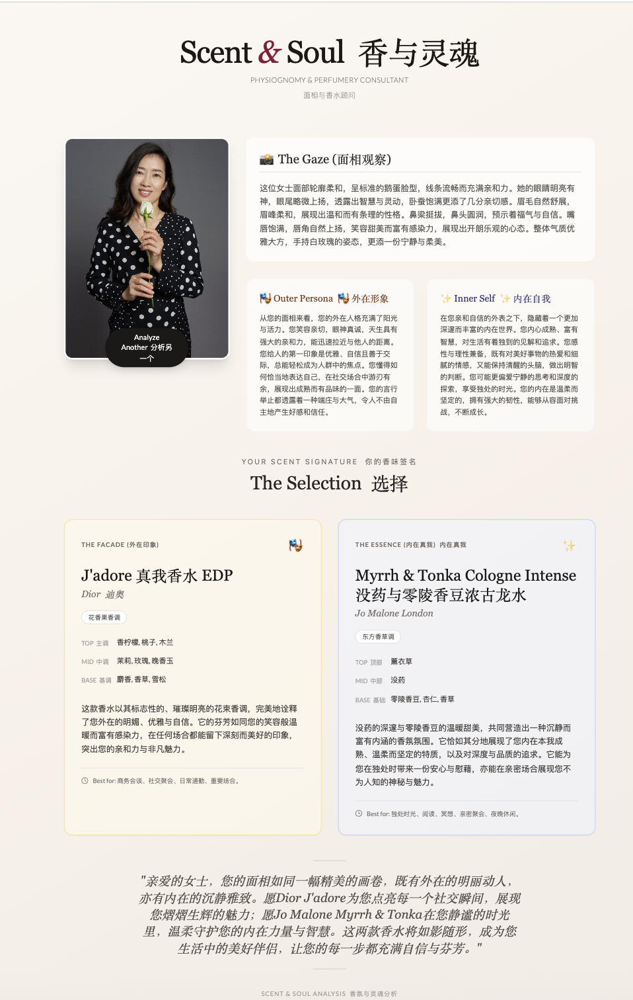

# Scent & Soul 香与灵魂

> AI 面相 x 香水推荐 — 上传一张人像照片，AI 解读你的面相特征，推荐契合你"外在人格"与"内在本我"的两款专属香水。

**Live Demo:** [scent-soul.vercel.app](https://scent-soul.vercel.app)



## How It Works

1. **Upload Portrait** — 上传一张清晰的人像照片
2. **Face Reading** — AI 分析面部特征（眼睛、眉毛、鼻子、嘴巴、脸型、气质）
3. **Scent Match** — 基于性格分析推荐两款香水：
   - **The Facade（外在印象）** — 匹配你的社交面具
   - **The Essence（内在真我）** — 匹配你的真实自我

每款推荐包含品牌、香调、前中后调、推荐理由和适用场景。

## Tech Stack

- **Frontend:** React 19 + TypeScript + Vite
- **AI Model:** Google Gemini 2.5 Flash（多模态图像理解 + 结构化 JSON 输出）
- **Deployment:** Vercel Edge Functions
- **Styling:** Tailwind CSS

## Design

- 温暖人文风格，衬线字体（Playfair Display）
- 渐变暖色背景，玻璃态卡片
- 完整的分析流程动画（上传 → 加载 → 结果展示）
- 移动端响应式适配

## Getting Started

```bash
# Clone
git clone https://github.com/yueying526/scent-soul.git
cd scent-soul

# Install
npm install

# Set up environment variable
echo "GEMINI_API_KEY=your_key_here" > .env

# Run dev server
npm run dev
```

Get a free Gemini API key at [aistudio.google.com/apikey](https://aistudio.google.com/apikey).

## Deploy to Vercel

1. Push to GitHub
2. Import project on [vercel.com](https://vercel.com)
3. Add environment variable: `GEMINI_API_KEY` = your Gemini API key
4. Deploy

## Author

**Yueying Wu** — [yueyingai.com](https://yueyingai.com) | [GitHub](https://github.com/yueying526)
